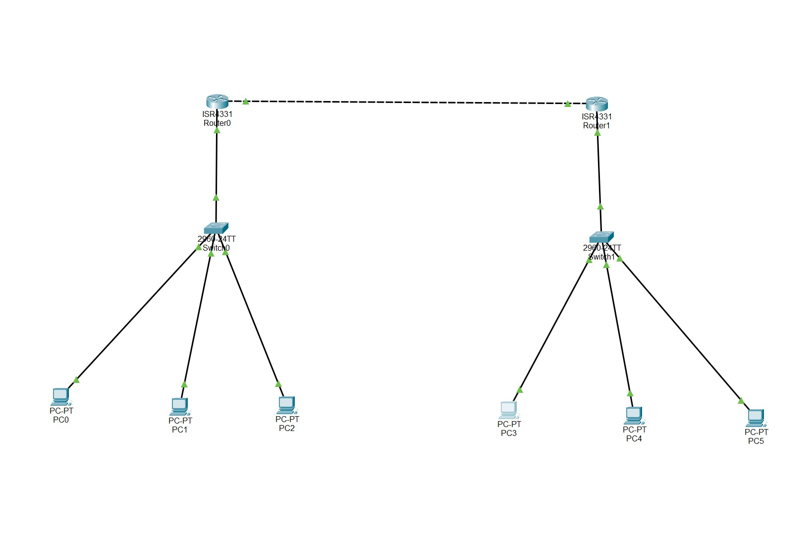
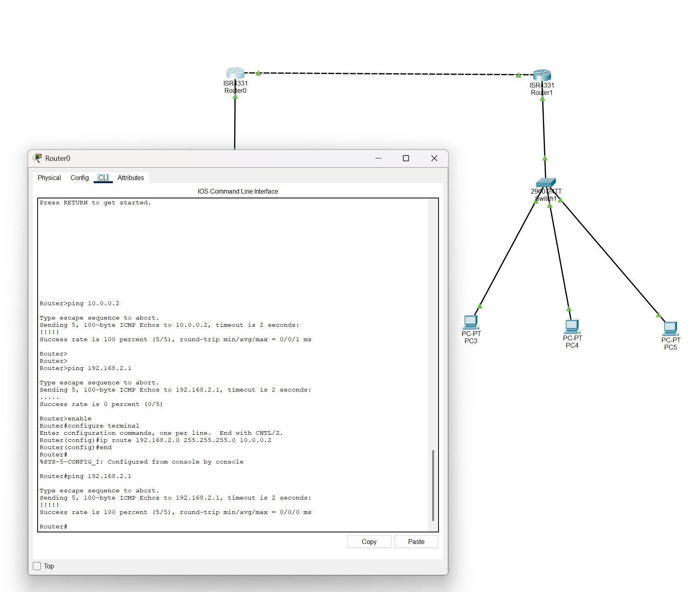
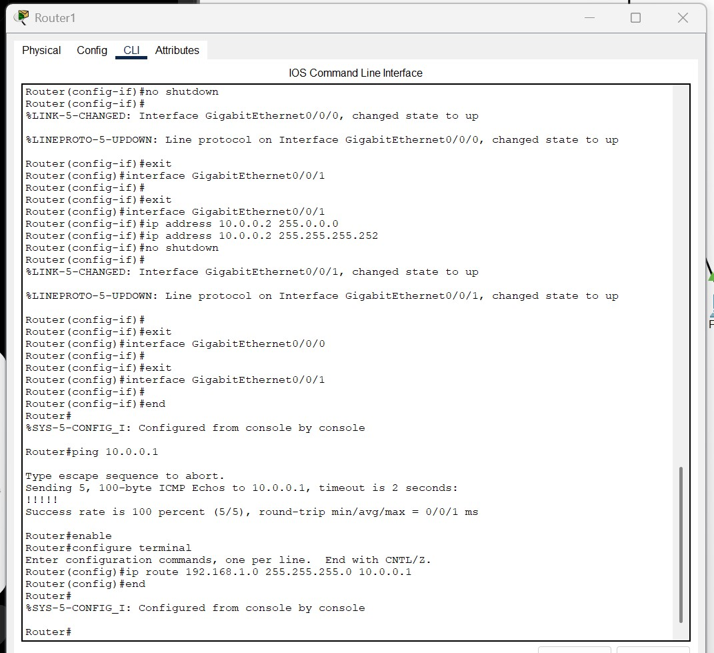
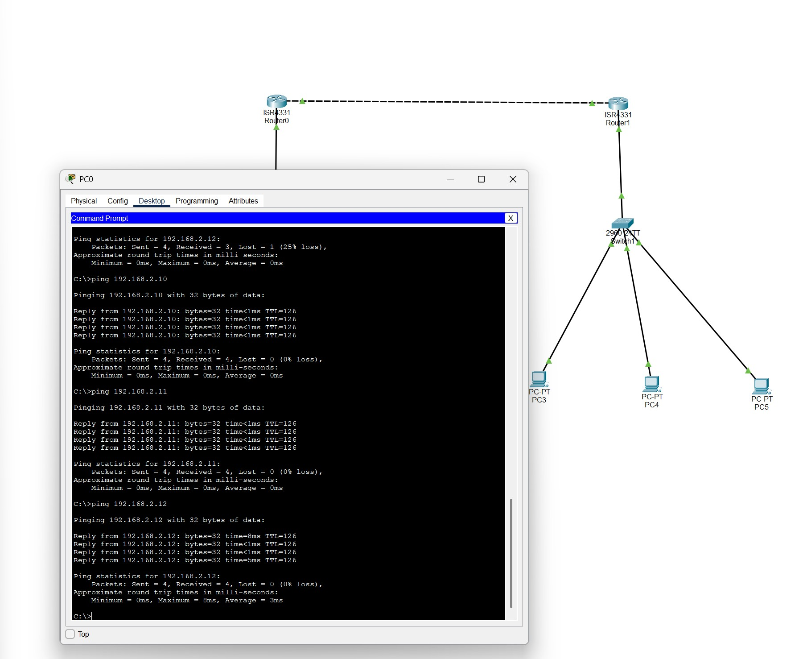
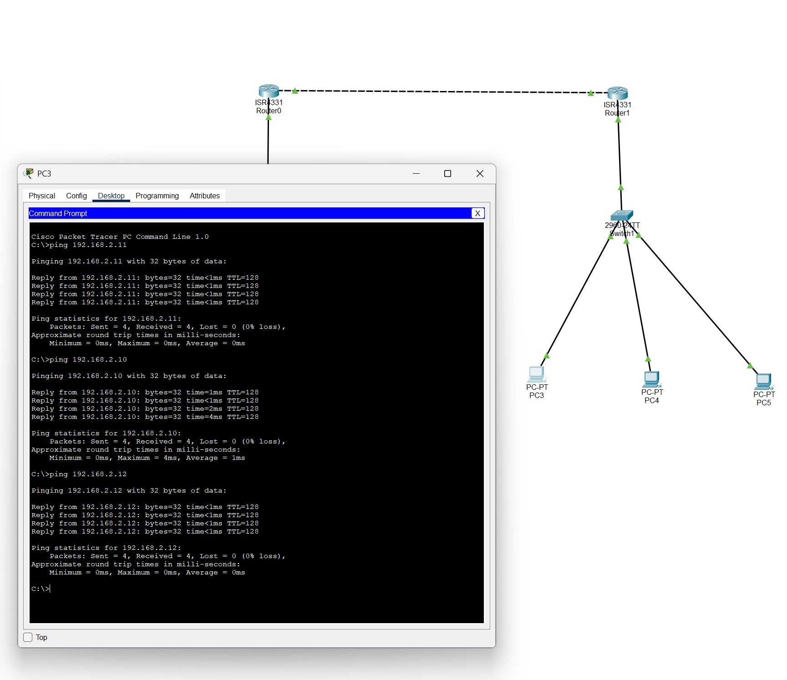

# Cisco Branch Office Network - Static Routing Lab

## Overview

This Cisco Packet Tracer project demonstrates communication between two separate LANs connected through two routers using static routing.

The objective was to configure IPv4 addressing, router interfaces, static routes, and verify end-to-end connectivity between all devices across both networks.

---

## Network Topology



---

## IP Addressing Scheme

| Device | Interface | IP Address |
|----------|----------|----------|
| Router0 | G0/0/0 | 192.168.1.1 |
| Router0 | G0/0/1 | 10.0.0.1 |
| Router1 | G0/0/0 | 192.168.2.1 |
| Router1 | G0/0/1 | 10.0.0.2 |
| PC0 | NIC | 192.168.1.10 |
| PC1 | NIC | 192.168.1.11 |
| PC2 | NIC | 192.168.1.12 |
| PC3 | NIC | 192.168.2.10 |
| PC4 | NIC | 192.168.2.11 |
| PC5 | NIC | 192.168.2.12 |

---

## Static Routing Configuration

### Router0

```bash
ip route 192.168.2.0 255.255.255.0 10.0.0.2
```



### Router1

```bash
ip route 192.168.1.0 255.255.255.0 10.0.0.1
```



---

## Connectivity Testing

### PC0 to Remote LAN



### PC3 to Remote LAN



---

## Skills Demonstrated

- Cisco Packet Tracer
- IPv4 Addressing
- Static Routing
- Router Configuration
- LAN Connectivity
- Network Troubleshooting
- End-to-End Connectivity Testing

---

## Project Files

- branch-office-static-routing-lab.pkt
- network-topology.jpg
- router0-static-route.jpg
- router1-static-route.jpg
- pc0-ping-test.jpg
- pc3-ping-test.jpg
